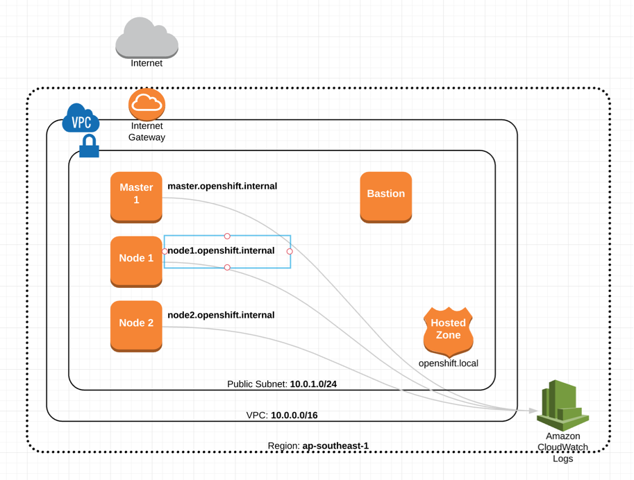
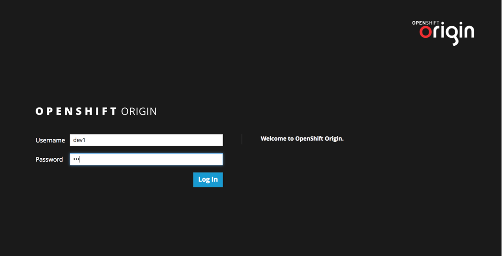

# terraform-aws-openshift

This project shows you how to set up OpenShift Origin on AWS using Terraform.

## Overview

Terraform is used to create infrastructure as shown:



Once the infrastructure is set up an inventory of the system is dynamically
created, which is used to install the OpenShift Origin platform on the hosts.

## Prerequisites

You need:

1. [Terraform](https://www.terraform.io/intro/getting-started/install.html) - `brew update && brew install terraform`
2. An AWS account, configured with the cli locally - `brew install awscli && aws configure`

## Creating the Cluster

Create the infrastructure first:

```bash
# Get the modules, create the infrastructure.
terraform get && terraform apply
```

You will be asked for a region to deploy in, use `us-east-1` or your preferred region. You can configure the nuances of how the cluster is created in the [`main.tf`](./main.tf) file. Once created, you will see a message like:

```
$ terraform apply
var.region
  Region to deploy the cluster into

  Enter a value: ap-southeast-1

...

Apply complete! Resources: 20 added, 0 changed, 0 destroyed.
```

That's it! The infrastructure is ready and you can install OpenShift.

## Installing OpenShift

Make sure you have your local identity added:

```
$ ssh-add ~/.ssh/id_rsa
```

Then create the inventory, copy it to the bastion and run the install script:

```bash
# Create our inventory from the template and terraform output. 
sed "s/\${aws_instance.master.public_ip}/$(terraform output master-public_ip)/" inventory.template.cfg > inventory.cfg

# Copy the inventory to the bastion.
scp ./inventory.cfg ec2-user@$(terraform output bastion-public_dns):~

# Run the installer on the bastion.
cat install-from-bastion.sh | ssh -A ec2-user@$(terraform output bastion-public_dns)
```

If the last line fails with an `ansible` not found error, just run it again. It will take about 10-15 minutes.

Open it by hitting port 8443 of the master node. Any username and password will work:

```bash
open "https://$(terraform output master-public_dns):8443"
```



## Additional Configuration

The easiest way to configure is to change the settings in the [./inventory.template.cfg](./inventory.template.cfg) file, based on settings in the [OpenShift Origin - Advanced Installation](https://docs.openshift.org/latest/install_config/install/advanced_install.html) guide.

Access the master or nodes to update configuration and add feature as needed:

```
$ oc login https://$(terraform output master-public_dns):8443

$ oc get nodes
NAME                     STATUS    AGE
master.openshift.local   Ready     1h
node1.openshift.local    Ready     1h
node2.openshift.local    Ready     1h
```

If you don't want to install the OpenShift client locally, you can access the hosts directly via the bastion:

```
$ ssh -A ec2-user@$(terraform output bastion-public_dns)

$ ssh master.openshift.local

$ sudo su && oc get nodes
NAME                     STATUS    AGE
master.openshift.local   Ready     1h
node1.openshift.local    Ready     1h
node2.openshift.local    Ready     1h
```

## Destroying the Cluster

Bring everything down with:

```
terraform destroy
```

## Pricing

You'll be paying for:

- 3 x t2.large instances

## Troubleshooting

**Image pull back off, Failed to pull image, unsupported schema version 2**

Ugh, stupid OpenShift docker version vs registry version issue. There's a workaround. First, ssh onto the master:

```
$ ssh -A ec2-user@$(terraform output bastion-public_dns)

$ ssh master.openshift.local
```

Now elevate priviledges, enable v2 of of the registry schema and restart:

```bash
sudo su
oc set env dc/docker-registry -n default REGISTRY_MIDDLEWARE_REPOSITORY_OPENSHIFT_ACCEPTSCHEMA2=true
systemctl restart origin-master.service
```

You should now be able to deploy. [More info here](https://github.com/dwmkerr/docs/blob/master/openshift.md#failed-to-pull-image-unsupported-schema-version-2).

## References

 - https://www.udemy.com/openshift-enterprise-installation-and-configuration - The basic structure of the network is based on this course.
 - https://blog.openshift.com/openshift-container-platform-reference-architecture-implementation-guides/ - Detailed guide on high available solutions, including production grade AWS setup.
 - https://access.redhat.com/sites/default/files/attachments/ocp-on-gce-3.pdf - Some useful info on using the bastion for installation.
 - http://dustymabe.com/2016/12/07/installing-an-openshift-origin-cluster-on-fedora-25-atomic-host-part-1/ - Great guide on cluster setup.

## TODO

- [ ] Consider moving the nodes into a private subnet.
